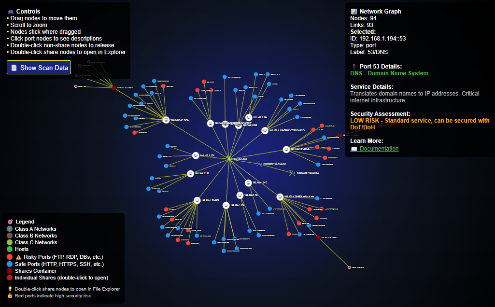

# 🌐 Network Vector

**Advanced Network Topology Scanner with Interactive D3.js Visualization**

Network Vector is a powerful, Python-based network scanning tool that performs comprehensive TCP port discovery without relying on external tools like nmap or masscan. It creates beautiful, interactive D3.js visualizations to map network topology and security posture.




[](https://www.python.org/downloads/)
[](https://opensource.org/licenses/MIT)

## ✨ Features

### 🚀 Core Capabilities
- **Raw TCP Port Scanning** - Scans 998 unique ports without external dependencies
- **Multi-threaded Performance** - Up to 1000 concurrent threads for fast scanning
- **Network Topology Discovery** - Automatic CIDR-based network hierarchy visualization
- **Interactive D3.js Graphs** - Professional force-directed network visualizations
- **SMB Share Enumeration** - Cross-platform Windows/Linux share discovery
- **Hostname Resolution** - Automatic reverse DNS lookup for discovered hosts

### 🎨 Visualization Features
- **Professional Network Icons** - SVG-based network topology representation
- **Host Icons** - PNG icons with embedded base64 encoding for self-contained HTML
- **Color-coded Security** - Risk-based port classification (red=dangerous, blue=safe)
- **Interactive Port Information** - Double-click ports for detailed descriptions and security assessments
- **Sticky Node Behavior** - Drag-and-drop node positioning with persistence
- **Collapse/Expand** - Right-click network nodes to manage complexity
- **Self-contained Output** - HTML files with embedded assets, no external dependencies
- **Embedded Scan Data** - Complete scan results embedded in HTML with "Show Scan Data" button

### 🔍 Port Intelligence
- **Comprehensive Database** - Detailed information for 130+ common services
- **Security Assessment** - Risk levels and vulnerability information for each port
- **Educational Links** - Direct links to service documentation and security resources
- **Service Detection** - Automatic identification of running services
- **Real-time Display** - Interactive port information on double-click

## 🛠️ Installation

### Prerequisites
- Python 3.8 or higher (for source code)
- Windows, Linux, or macOS
- **OR use the pre-built executable (no Python required!)**

### Option 1: Pre-built Executable (Recommended)
```bash
# Clone the repository
git clone https://github.com/artofscripting/networkvector.git
cd networkvector

# Download the latest executable from Releases tab on GitHub
# Or build it yourself using the instructions below

# Run immediately with no setup required
./nvector.exe 192.168.1.0/24

# All features included: 1000 threads, embedded data, interactive visualization
```

**Note**: Pre-built executables are available in the [Releases section](https://github.com/artofscripting/networkvector/releases) of this repository.

### Option 2: Python Source

### Quick Start
```bash
# Clone the repository
git clone https://github.com/artofscripting/networkvector.git
cd networkvector

# Install dependencies (none required - uses only Python standard library!)

# Run a basic scan (uses 1000 threads by default for maximum speed)
python src/nvector.py 192.168.1.1

# Scan entire network with full features
python src/nvector.py 192.168.1.0/24 --resolve-hostnames --enumerate-shares

# Use the pre-built executable (no Python required!)
./nvector.exe 192.168.1.0/24
```

### Build Executable (Optional)
```bash
# Install PyInstaller
pip install pyinstaller

# Navigate to source directory
cd src

# Build standalone executable with all dependencies
pyinstaller --onefile --add-data "custom_d3_graph.py;." --hidden-import=webbrowser --name="nvector" nvector.py

# Run the executable
./dist/nvector.exe 192.168.1.0/24
```

**Pre-built Executable Available**: A ready-to-use `nvector.exe` is included in the repository for immediate use without Python installation.

## 📖 Usage Examples

### Basic Network Scan
```bash
# Scan a single host (uses 1000 threads by default)
python src/nvector.py 192.168.1.100

# Or use the pre-built executable
./nvector.exe 192.168.1.100

# Scan a network range
python src/nvector.py 192.168.1.0/24
```

### Advanced Scanning
```bash
# Full feature scan with hostname resolution and SMB enumeration (default 1000 threads)
python src/nvector.py 192.168.1.0/24 --resolve-hostnames --enumerate-shares

# Reduce threads for stealth scanning
python src/nvector.py 192.168.1.0/24 --threads 50

# Custom port range
python src/nvector.py 192.168.1.1 --ports 22 80 443 3389 5432

# Custom timeout for slow networks
python src/nvector.py 192.168.1.0/24 --timeout 2.0

# Maximum performance with executable
./nvector.exe 192.168.1.0/24 --threads 1000
```

### Output Options
```bash
# Skip graph generation (console output only)
python src/nvector.py 192.168.1.0/24 --no-graph

# Disable specific features
python src/nvector.py 192.168.1.0/24 --no-resolve-hostnames --no-enumerate-shares
```

## 🎯 Command Line Options

| Option | Description | Default |
|--------|-------------|---------|
| `target` | IP address or network (e.g., 192.168.1.1 or 192.168.1.0/24) | Required |
| `--timeout` | Connection timeout in seconds | 0.5 |
| `--threads` | Maximum number of scanning threads | 1000 |
| `--ports` | Custom ports to scan | 998 common ports |
| `--no-graph` | Skip D3.js visualization generation | Enabled |
| `--no-resolve-hostnames` | Disable reverse DNS lookup | Enabled |
| `--no-enumerate-shares` | Disable SMB share enumeration | Enabled |

## 📊 Output Format

### Interactive HTML Visualization
Network Vector generates a single, self-contained HTML file with:
- **Force-directed network graph** with D3.js v7
- **Professional network topology** representation with SVG icons
- **Interactive port information** with security details for 130+ ports
- **Embedded scan data** - complete analysis data built into the HTML file
- **Show Scan Data button** - view raw scan results without separate JSON files
- **Responsive design** for desktop and mobile viewing
- **Timestamped filename** for historical tracking (e.g., `network_scan_20251106_141532.html`)
- **No external dependencies** - works offline with all assets embedded

### Key Features:
- **Drag-and-drop nodes** with sticky positioning
- **Right-click collapse/expand** for network organization
- **Double-click port details** with security assessments
- **Color-coded risk levels** (red for dangerous, blue for safe ports)
- **Network hierarchy visualization** with CIDR-based topology

## 🔧 Technical Details

### Architecture
- **Pure Python Implementation** - No external scanning tools required
- **Socket-based Scanning** - Raw TCP connection attempts
- **Multi-threaded Design** - Concurrent scanning for performance
- **Modular Structure** - Separate scanning and visualization components

### Port Coverage
Network Vector scans **998 unique ports** covering:
- **System Services** (1-1024): SSH, HTTP, HTTPS, FTP, Telnet, etc.
- **Database Ports** (1433, 3306, 5432, etc.): SQL Server, MySQL, PostgreSQL
- **Application Services** (8080, 9000, etc.): Web applications and APIs
- **Development Ports** (3000-4000): Node.js, Rails, Django applications
- **Enterprise Services** (389, 636, etc.): LDAP, Active Directory

### Visualization Technology
- **D3.js v7** - Latest version for maximum compatibility
- **Force-directed Layout** - Automatic node positioning with physics simulation
- **SVG Rendering** - Scalable vector graphics for crisp visuals
- **Base64 Embedding** - Self-contained HTML with no external dependencies

## 🛡️ Security Considerations

### Ethical Use
- **Educational Purpose** - Designed for learning network security concepts
- **Authorized Testing Only** - Only scan networks you own or have permission to test
- **Responsible Disclosure** - Report vulnerabilities through proper channels

### Detection Avoidance
Network Vector performs basic TCP scanning which may be detected by:
- Intrusion Detection Systems (IDS)
- Firewall logs
- Network monitoring tools

For stealth scanning, consider:
- Reducing thread count (`--threads 1-10`)
- Increasing timeout values (`--timeout 2.0`)
- Scanning during low-traffic periods

## 🤝 Contributing

We welcome contributions! Please see our contributing guidelines:

1. **Fork the repository**
2. **Create a feature branch** (`git checkout -b feature/amazing-feature`)
3. **Commit your changes** (`git commit -m 'Add amazing feature'`)
4. **Push to the branch** (`git push origin feature/amazing-feature`)
5. **Open a Pull Request**

### Development Setup
```bash
# Clone your fork
git clone https://github.com/yourusername/networkvector.git
cd networkvector

# Create development branch
git checkout -b feature/your-feature

# Make changes and test
python src/nvector.py 127.0.0.1 --threads 10
```

## 📄 License

This project is licensed under the MIT License - see the [LICENSE](LICENSE) file for details.

## 🙏 Acknowledgments

- **D3.js Community** - For the incredible visualization framework
- **Python Community** - For the robust standard library that makes this possible
- **Network Security Community** - For inspiration and best practices
- **Open Source Contributors** - For making tools like this possible

## 📞 Support

- **Issues**: [GitHub Issues](https://github.com/artofscripting/networkvector/issues)
- **Discussions**: [GitHub Discussions](https://github.com/artofscripting/networkvector/discussions)
- **Documentation**: [Project Wiki](https://github.com/artofscripting/networkvector/wiki)

---

**Network Vector** - Mapping networks, visualizing security, empowering defenders.

*Made with ❤️ by the ArtOfScripting community*